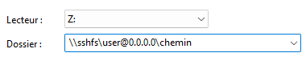

<header>

# SSH-FS

_Le File System de SSH, expliqué pour pouvoir monter des partages réseaux adhoc, avec n'importe quelles machines disposant de SSHFS, pour faciliter l'exploitation d'une arborescence de travail._

</header>

-   <details>
    <summary><strong>Résumé</strong>
    </summary>

    SSH-FS utilise SFTP, lui-même basé sur SSH. L'idée ici est de monté un lecteur réseau adhoc pour pouvoir travailler sur le répertoire d'une machine distante.

    </details>

-   <details>
    <summary><strong>Installation</strong>
    </summary>

    -   <details>
        <summary><strong>Sous Windows</strong>
        </summary>
        <br>
        <p>Deux paquets sont nécessaires, à installer dans l'ordre:

        1. WinFsp: https://github.com/winfsp/winfsp/releases
        2. SSHFS-Win: https://github.com/winfsp/sshfs-win/releases/
        <br>

        __WinFsp__ permet aux développeurs d'écrire leur propre système de fichier sous Windows.

        __SSHFS-Win__ vous permettra de mapper n'importe quel dossier d'une machine cible à portée de SSH.
        </p>
        </details>

    -   <details>
        <summary><strong>Sous Linux</strong>
        </summary>    
        Installation classique sous repo apt:

        ```
            sudo apt update
            sudo apt install sshfs
        ```
        </details>

    </details>

-   <details>
    <summary><strong>Montage du volume</strong>
    </summary>    

    -   <details>
        <summary><strong>Sous Windows</strong>
        </summary> 

        -   <details>
            <summary><strong>Graphiquement</strong>
            </summary>       
            
            Il est possible de faire le montage en interface graphique.

            Dans l'explorer, clique droit sur 

            Puis, 

            Et enfin renseigner le chemin du montage, avec le nom de l'utilisateur de connexion et la machine cible (IP ou DNS):

            

            Une fenêtre de connexion s'affichera pour renseigner les identifiants.

            Pour les subtilités de l'appel ~~non pas du 18 juin, ni celui de la forêt, ou encore du râteau~~ mais du chemin, cf. infra.
            
            </details>

        -   <details>
            <summary><strong>Par PowerShell</strong>
            </summary> 

            L'outil `net use` est ton ami:
            ```powershell
            net use X: \\sshfs\bob@0.0.0.0\..\..\etc /user:bob
            ```

            L'option `/user:` est optionnelle, elle évite de retaper le login de connexion qui sera demandé par la suite.

            Il est possible de gérer la connexion par clés SSH, comme pour une connexion SSH classique.

            En se connectant à une machine Linux, le répertoire de référence est celui de l'utilisateur de connexion. Donc pour se connecter à la racine d'un OS Linux, il faut préciser:
            `net use X: \\sshfs\user@0.0.0.0\..\..`. On remonte ainsi de `/user` à `/home` et de `/home` à `/ `.
                <details>
                <summary><strong>Démonter le volume</strong>
                </summary>
                ```
                PS C:\Users\user> net use X: /delete
                ```
                </details>
            </details>

    -   <details>
        <summary><strong>Sous Linux</strong>
        </summary>

        Une syntaxe très similaire à OpenSSH:
        
        ```bash
        sshfs user@0.0.0.0:/dossier/cible /mnt/dossier/de/travail
        ```

        Détails: après avoir précisé la commande `sshfs`, on indique la connexion distante, à savoir:
        
        L'utilisateur de connexion, l'hôte et l'arborescence cible.
        
        Puis en dernier argument, le montage local d'où est lancé la commande.

        NB1: Sur un système Linux, le dossier racine `/mnt` est dédié aux points de montage.

        NB2: Le dossier cible doit être exécutable pour voir son contenu visible par SSHFS (mais pas spécialement son contenu)

        NB3: Le répertoire de référence d'une connexion SSHFS est comme celui d'une connexion SSHFS: le répertoire de l'utilisateur.
        Ainsi, pour pouvoir monter toute l'arborescence d'un OS Linux, il faut préciser le chemin de connexion suivant:
        `user@0.0.0.0:/../..`. On remonte ainsi de `/user` à `/home` et de `/home` à `/ `.

        </details>
    
    
    </details>